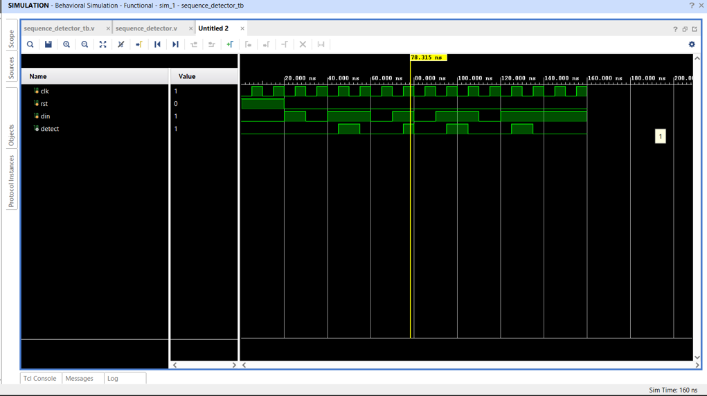
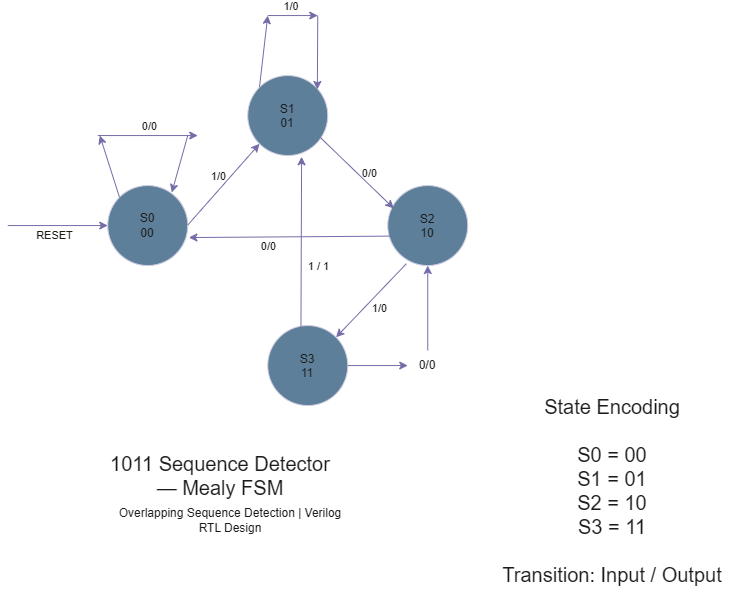

# 1011 Sequence Detector — Mealy FSM

A synchronous **1011 sequence detector** designed using a **Finite State Machine (FSM)** and implemented in **Verilog HDL**.

This project demonstrates RTL design, FSM modeling, Verilog implementation, functional verification, behavioral simulation, waveform analysis, and professional GitHub project organization.

---

## Project Overview

The objective of this project is to design a digital circuit that detects the serial bit sequence:

`1011`

Whenever the input stream contains the sequence `1011`, the detector asserts `detect = 1`.

The design uses a **Mealy FSM**, where the output depends on both the current state and the current input.

The detector supports **overlapping sequence detection**, allowing continuous serial data streams to be processed without losing potential overlapping occurrences.

---

## Objectives

- Design a sequence detector for the pattern `1011`
- Implement the design using a Mealy FSM
- Develop synthesizable Verilog RTL
- Define and verify FSM state transitions
- Develop a Verilog testbench
- Perform behavioral simulation using Xilinx Vivado
- Analyze simulation waveforms
- Verify overlapping sequence detection
- Maintain a structured and professional GitHub repository

---

## Design Specifications

| Parameter | Specification |
|---|---|
| Target Pattern | `1011` |
| FSM Type | Mealy |
| Number of States | 4 |
| State Encoding | 2-bit |
| Input | 1-bit serial data |
| Output | 1-bit detection signal |
| Clock | Rising-edge triggered |
| Reset | Active-high |
| Overlapping Detection | Supported |
| HDL | Verilog HDL |

---

## Design Methodology

```text
Specification
      ↓
FSM State Definition
      ↓
State Encoding
      ↓
State Transition Design
      ↓
Verilog RTL Implementation
      ↓
Testbench Development
      ↓
Behavioral Simulation
      ↓
Waveform Verification

## FSM Architecture

The design uses a 4-state Mealy Finite State Machine to detect the overlapping sequence `1011`.

### State Encoding

| State | Encoding | Description |
|---|---|---|
| S0 | 00 | Initial state / no matching bits |
| S1 | 01 | Detected `1` |
| S2 | 10 | Detected `10` |
| S3 | 11 | Detected `101` |

### State Transitions

| Current State | Input | Next State | Detect |
|---|---:|---|---:|
| S0 | 0 | S0 | 0 |
| S0 | 1 | S1 | 0 |
| S1 | 0 | S2 | 0 |
| S1 | 1 | S1 | 0 |
| S2 | 0 | S0 | 0 |
| S2 | 1 | S3 | 0 |
| S3 | 0 | S2 | 0 |
| S3 | 1 | S1 | 1 |

The output `detect` becomes HIGH when the FSM is in state `S3` and the input `din` is `1`, indicating that the sequence `1011` has been detected.

The design supports overlapping sequence detection. After detecting `1011`, the FSM returns to `S1`, allowing a new sequence to begin immediately.

---

## RTL Implementation

The RTL design is implemented using Verilog HDL.

The design consists of three main processes:

1. **State Register**
   - Updates the current state on every rising edge of the clock.
   - Active-high reset returns the FSM to `S0`.

2. **Next-State Logic**
   - Determines the next FSM state based on the current state and input `din`.

3. **Output Logic**
   - Generates the Mealy detection output.
   - `detect = 1` when `current_state = S3` and `din = 1`.

RTL source:

`src/sequence_detector.v`

---

## Verification

A dedicated Verilog testbench was created to verify the sequence detector.

Testbench source:

`tb/sequence_detector_tb.v`

The testbench:

- Generates a clock with a 10 ns period.
- Applies an active-high reset.
- Provides serial input data through `din`.
- Tests multiple occurrences of the `1011` sequence.
- Verifies the detection output.
- Runs behavioral simulation using Vivado.

The input sequence used for verification contains multiple occurrences of `1011`, including overlapping detection cases.

---

## Simulation Results

The RTL was simulated using Xilinx Vivado Behavioral Simulation.

The waveform verifies:

- Correct clock generation.
- Correct reset behavior.
- Correct serial input sequence.
- `detect` becoming HIGH when `1011` is received.
- Correct operation of the Mealy FSM.

### Waveform



### FSM State Diagram



---

## Project Structure

```text
verilog-1011-sequence-detector/
│
├── src/
│   └── sequence_detector.v
│
├── tb/
│   └── sequence_detector_tb.v
│
├── simulation/
│   ├── waveform.png
│   └── state_diagram.png
│
└── README.md

## Directory Description
Directory / File	Purpose
src/	RTL design source files
tb/	Verilog testbench files
simulation/	Simulation waveform and FSM diagram
README.md	Project documentation
Tools & Technologies
Verilog HDL
Xilinx Vivado
Behavioral Simulation
RTL Design
Finite State Machines
Git
GitHub
draw.io
Key Concepts Demonstrated
Finite State Machine design
Mealy FSM architecture
Sequence detection
Overlapping sequence detection
State encoding
Sequential logic
Combinational next-state logic
Mealy output logic
Verilog RTL coding
Testbench development
Behavioral simulation
Waveform analysis
RTL verification
Git and GitHub project documentation
Design Highlights
4-state Mealy FSM
2-bit state encoding
1-bit serial input
1-bit detection output
Active-high synchronous reset
Rising-edge triggered state transitions
Overlapping 1011 sequence detection
Verified through behavioral simulation
Future Improvements

Possible extensions to the project include:

Parameterized sequence detection
Support for programmable detection patterns
Moore FSM implementation for comparison
FPGA board implementation
Hardware LED indication when the sequence is detected
SystemVerilog-based verification
Self-checking testbench
Functional coverage
Assertion-based verification
Conclusion

This project demonstrates the complete RTL design and verification flow of a Mealy FSM-based 1011 sequence detector.

The design was modeled in Verilog HDL, verified using a dedicated testbench, and validated through behavioral simulation in Vivado.

The project demonstrates practical understanding of FSM design, RTL implementation, simulation, verification, and GitHub-based project documentation.

Author

Munjala Aryan

Aspiring VLSI Design Engineer

Project Focus

Digital Design | Verilog HDL | RTL Design | FSM | VLSI
